# Project Management Kissflow Components

A collection of **Kissflow custom Page / Component apps** for **Project Management (PMT)**, built with **React 19**, **Vite 8**, and **Tailwind CSS v3**.

Each page is a self-contained SPA that runs inside Kissflow using the [`@kissflow/lowcode-client-sdk`](https://www.npmjs.com/package/@kissflow/lowcode-client-sdk). You build **one page at a time**, zip the output, and upload it as a Kissflow **Page** or **Component** app.

This repository is intended for teams and community members who want a **production-ready starting point** for CTO dashboards, project lists, task boards, employee workspaces, and reports on Kissflow — with real Case API wiring, popup integration, RAG health indicators, and responsive UI patterns already in place.

**Repository:** [github.com/raghulje/ProjectManagement_KF_Components](https://github.com/raghulje/ProjectManagement_KF_Components)

---

## Table of contents

- [What is included](#what-is-included)
- [Architecture](#architecture)
- [Tech stack](#tech-stack)
- [Prerequisites](#prerequisites)
- [Quick start](#quick-start)
- [Choosing which page to build](#choosing-which-page-to-build)
- [Building for Kissflow](#building-for-kissflow)
- [Uploading to Kissflow](#uploading-to-kissflow)
- [Project structure](#project-structure)
- [How Kissflow integration works](#how-kissflow-integration-works)
- [Environment variables](#environment-variables)
- [Page components in detail](#page-components-in-detail)
- [Shared modules](#shared-modules)
- [UI and UX conventions](#ui-and-ux-conventions)
- [Customizing for your tenant](#customizing-for-your-tenant)
- [Troubleshooting](#troubleshooting)
- [Scripts reference](#scripts-reference)
- [Contributing](#contributing)

---

## What is included

This repo ships **six Kissflow entry points**. Only **one** is active at build time (controlled in `src/App.jsx`).

| Component | File | Kissflow manifest | Description |
|-----------|------|-------------------|-------------|
| **ProjectDashboardPage** | `ProjectDashboardPage.jsx` | Component | CTO / executive dashboard — KPIs, RAG summary, project health table, subtasks, delay & revision tracking, popup actions. Single-file bundle with inline Kissflow API layer. |
| **ProjectsManagementPage** | `ProjectsManagementPage.jsx` | Component | Projects list — table view, create-project modal, project detail drawer, mock + live-ready layout via `ProjectTrackerShell`. |
| **TasksProject** | `TasksProject.jsx` | Component | Task management — task list, add-task modal, completion flow via shell route `/tasks`. |
| **ReportsProject** | `ReportsProject.jsx` | **Page** | Reports & analytics — charts and project metrics from Kissflow Case data. |
| **HelpProject** | `HelpProject.jsx` | Component | Help & documentation page for end users. |
| **EmployeeDashboardProject** | `EmployeeDashboardProject.jsx` | Component | Employee workspace — personal KPIs, assigned projects, subtasks, progress charts. Single-file Kissflow bundle. |

### Build output

A successful build produces:

```
dist/
├── index.html
├── manifest.json      ← { "Category": "Component" | "Page", "Framework": "React" }
└── assets/
    ├── index-*.css
    └── index-*.js
```

The `npm run zip` script packages `dist/` into a zip file named after the active component (e.g. `ProjectDashboardPage.zip`, `ReportsProject.zip`).

> **Note:** `ReportsProject` is built with `KF_MANIFEST_CATEGORY=Page`; all other roots default to `Component`. Match the upload type in Kissflow Admin to the manifest category.

---

## Architecture

```mermaid
flowchart TB
    subgraph kissflow [Kissflow Runtime]
        KF[window.kf SDK]
    end

    subgraph spa [React SPA]
        HTML[index.html]
        MAIN[main.jsx]
        SDK[SDKWrapper]
        APP[App.jsx]
        PAGE[Active Page Component]
        RUNTIME[kfRuntime.js]
        PMDATA[kfProjectDashboard.js]
    end

    subgraph shell [Shell-based pages]
        PTS[ProjectTrackerShell]
        ROUTER[MemoryRouter + routes]
        PAGES[pages/projects · tasks · reports · help · employee-dashboard]
    end

    HTML --> MAIN
    MAIN --> SDK
    SDK --> APP
    APP --> PAGE
    PAGE --> RUNTIME
    PAGE --> PMDATA
    PAGE -->|shell wrappers| PTS
    PTS --> ROUTER
    ROUTER --> PAGES
    SDK --> KF
    PAGE -->|kf.api / openPopup| KF
    PMDATA -->|Case list / fields| KF
```



**Runtime flow:**

1. Kissflow loads `index.html` inside a Page / Component app iframe.
2. `SDKWrapper` initializes `@kissflow/lowcode-client-sdk` (or uses `window.kf` if already present).
3. `App.jsx` renders exactly **one** root page component.
4. **Standalone bundles** (`ProjectDashboardPage`, `EmployeeDashboardProject`) embed layout + API logic in a single file.
5. **Shell wrappers** (`ProjectsManagementPage`, `TasksProject`, etc.) mount `ProjectTrackerShell` with a starting route (`/projects`, `/tasks`, …).
6. Data is fetched via `kf.api()` through helpers in `lib/kfProjectDashboard.js` and `lib/kfRuntime.js`.
7. User actions (view task, create project) call `kf.app.page.openPopup(...)` where configured.

---

## Tech stack

| Layer | Choice |
|-------|--------|
| Framework | React 19 |
| Bundler | Vite 8 |
| Styling | Tailwind CSS v3 |
| Routing | React Router v7 (in-memory router inside shell pages) |
| Charts | Recharts |
| Animations | Framer Motion, AOS (scroll animations on dashboards) |
| i18n | i18next + react-i18next |
| Kissflow | `@kissflow/lowcode-client-sdk` |
| Icons | Remix Icon (`ri-*` classes, CDN) |

---

## Prerequisites

- **Node.js** `>=18.0.0` (recommended: 20 LTS)
- **npm** (used by install and zip scripts)
- A Kissflow account with:
  - **Project Management** Case application (`Project_Management_A01` or your equivalent)
  - Project list view configured
  - Popup IDs for task / project flows (if using popups)

---

## Quick start

### 1. Clone and install

```bash
git clone https://github.com/raghulje/ProjectManagement_KF_Components.git
cd ProjectManagement_KF_Components
npm install
```

### 2. Configure environment (local preview)

Copy the example env file and adjust IDs for your Kissflow tenant:

```bash
cp .env.example .env
```

When running **inside Kissflow**, account and case IDs are read automatically from `window.kf`. The `.env` file is mainly for **local Vite dev** when the SDK is unavailable.

### 3. Choose your page

Edit `src/App.jsx` — uncomment **one** component and comment out the rest:

```jsx
function App() {
  return (
    <div className="rootDiv">
      <ProjectDashboardPage />
      {/* <ProjectsManagementPage /> */}
      {/* <TasksProject /> */}
      {/* <ReportsProject /> */}
      {/* <HelpProject /> */}
      {/* <EmployeeDashboardProject /> */}
    </div>
  )
}
```

### 4. Run locally

```bash
npm run dev
```

Open the URL Vite prints (default `http://localhost:3000`). Outside Kissflow you will see a yellow **Preview mode** banner — the UI still renders, but live API calls need the SDK or correct env fallbacks.

### 5. Build and zip for Kissflow

```bash
npm run zip
```

This runs `vite build`, then creates a zip at the project root (e.g. `ProjectDashboardPage.zip`). Zip files are **gitignored** — generate them locally only.

---

## Choosing which page to build

The zip script (`scripts/zip.js`) **auto-detects** the active component in `App.jsx`:

1. Strips block comments from `App.jsx`
2. Finds the first uncommented `<ComponentName />` tag
3. Names the zip accordingly (`ProjectDashboardPage` → `ProjectDashboardPage.zip`)

**Supported root components:**

- `ProjectDashboardPage`
- `ProjectsManagementPage`
- `TasksProject`
- `ReportsProject`
- `HelpProject`
- `EmployeeDashboardProject`

> **Tip:** Build and upload **one zip per Kissflow app**. If you need all six experiences in Kissflow, create six separate Page/Component apps — each with its own `App.jsx` selection and zip.

---

## Building for Kissflow

### Production build only

```bash
npm run build
```

Output goes to `dist/`. The Vite plugin automatically writes `dist/manifest.json`:

```json
{
  "Category": "Component",
  "Framework": "React"
}
```

For `ReportsProject`, the zip script sets `"Category": "Page"`.

### Important Vite settings

From `vite.config.ts`:

- **`base: ''`** — relative asset paths so the bundle works inside Kissflow’s CDN hosting
- **Manifest plugin** — required for Kissflow to recognize the upload as a React app
- **`@` alias** — maps to `./src` for clean imports

---

## Uploading to Kissflow

1. Run `npm run zip` for the page you want.
2. In Kissflow, go to **Admin** → **Apps** → create or open a **Page** or **Component** app.
3. Upload the generated zip (e.g. `ProjectDashboardPage.zip`).
4. Publish the app and add it to a portal or menu.
5. Open the page **inside Kissflow** (not just the raw CDN URL) so `window.kf` is available.

### What Kissflow expects in the zip

| File | Required | Purpose |
|------|----------|---------|
| `index.html` | Yes | Entry HTML |
| `manifest.json` | Yes | Declares Page/Component + React |
| `assets/*` | Yes | Bundled JS/CSS |

Do **not** commit `.env`, credentials, or `*.zip` files to git (see `.gitignore`).

---

## Project structure

```
project-management-kf-components/
├── index.html                 # Vite entry (fonts, Remix icons)
├── package.json
├── vite.config.ts             # Build + manifest.json emission
├── tailwind.config.ts
├── postcss.config.ts
├── tsconfig.json
├── .env.example               # Documented env fallbacks
├── .gitignore                 # Excludes node_modules, dist, *.zip
├── LICENSE
├── scripts/
│   └── zip.js                 # Build + zip for Kissflow upload
└── src/
    ├── App.jsx                # Single active page selector
    ├── main.jsx               # React root + SDKWrapper + error boundary
    ├── index.css              # Tailwind + global styles
    │
    ├── ProjectDashboardPage.jsx       # CTO dashboard (standalone bundle)
    ├── EmployeeDashboardProject.jsx   # Employee dashboard (standalone bundle)
    ├── ProjectsManagementPage.jsx     # Shell → /projects
    ├── TasksProject.jsx               # Shell → /tasks
    ├── ReportsProject.jsx             # Shell → /reports
    ├── HelpProject.jsx                # Shell → /help
    │
    ├── ProjectTrackerShell.jsx        # MemoryRouter + i18n + embed context
    ├── DashboardPage.jsx              # Shell route → ProjectDashboardPage
    ├── ProjectsPage.jsx               # Shell route → pages/projects
    ├── TasksPage.jsx                  # Shell route → pages/tasks
    ├── ReportsPage.jsx                # Shell route → pages/reports
    ├── HelpPage.jsx                   # Shell route → pages/help
    ├── EmployeeDashboardPage.jsx      # Shell route → pages/employee-dashboard
    │
    ├── lib/
    │   ├── kfRuntime.js               # Account ID, origin, kfGetJson
    │   └── kfProjectDashboard.js      # Case paths, mapping, fetch helpers
    │
    ├── pages/
    │   ├── projects/                  # Project table, drawer, create modal
    │   ├── tasks/                     # Task list + add modal
    │   ├── reports/                   # Analytics page
    │   ├── help/                      # Help content
    │   ├── employee-dashboard/        # Employee KPIs, tables, charts
    │   └── NotFound.jsx
    │
    ├── components/
    │   ├── feature/                   # AppLayout, Sidebar, Topbar
    │   └── base/                      # Button, Modal, Drawer, Badge, …
    │
    ├── contexts/
    │   └── ProjectTrackerEmbedContext.jsx
    │
    ├── mocks/                         # Fallback data for shell pages in preview
    ├── router/                        # Route config for ProjectTrackerShell
    ├── sdk/                           # SDK bootstrap + React context
    └── i18n/                          # i18next setup
```

---

## How Kissflow integration works

### SDK initialization

`src/sdk/wrapper.jsx`:

- Uses `window.kf` if Kissflow already injected it
- Otherwise calls `KFSDK.initialize()` from `@kissflow/lowcode-client-sdk`
- Provides `{ kf, sdkReady }` via `KissflowSDKContext`
- Shows a non-blocking banner when SDK init fails (local preview)

Page components access the SDK like this:

```jsx
import { kf, KissflowSDKContext } from './sdk/index.js'

const { kf: kfFromContext, sdkReady } = useContext(KissflowSDKContext)
const kfInstance = kfFromContext ?? window.kf ?? kf
```

### Case API (Project Management)

`lib/kfProjectDashboard.js` centralizes Kissflow Case REST paths:

| Constant / function | Use case |
|---------------------|----------|
| `CASE_ID` | Project Management case technical name (default `Project_Management_A01`) |
| `getProjectItemsPath(accountId)` | All projects list view |
| `getFieldsPath(accountId)` | Case field metadata |
| `fetchProjectDashboardData(kf)` | Aggregated dashboard payload for CTO / reports views |
| `mapRag`, `mapStatus`, `mapSubtaskStatus` | RAG health and status normalization |

Account ID comes from `resolveKissflowAccountId()` in `kfRuntime.js` (SDK → URL inference → fallback).

### API calls

**Preferred:** `kf.api(path, { method, headers: { Accept: 'application/json' } })`

**Fallback:** `kfGetJson(kfInstance, path)` uses `fetch` with `credentials: 'include'` when SDK is unavailable.

`kfRuntime.js` resolves the correct tenant origin and avoids calling APIs against CDN-only hosts.

### Popups

Create and view flows use Kissflow popups where configured:

```js
kf.app.page.openPopup(POPUP_ID, {
  InstanceId,
  ActivityId,
  ActivityInstanceId,
  width,
  height,
})
```

Always wrap `openPopup` in try/catch — it may be unavailable in preview mode.

### Two deployment patterns

| Pattern | Components | When to use |
|---------|------------|-------------|
| **Standalone bundle** | `ProjectDashboardPage`, `EmployeeDashboardProject` | Single Kissflow upload; all UI + API in one file; fastest to deploy |
| **Shell + routes** | `ProjectsManagementPage`, `TasksProject`, `ReportsProject`, `HelpProject` | Multi-section SPA with sidebar navigation inside one upload |

---

## Environment variables

All variables use the `VITE_` prefix (bundled into the client by Vite). Copy `.env.example` to `.env` and fill in **your own Kissflow tenant** values.

> **Important — your data stays yours**
>
> This repository is a **template / reference implementation**. It does **not** include production account ids, case ids, or tenant URLs tied to a specific customer.
>
> - When the page runs **inside Kissflow**, ids are resolved from `window.kf` automatically.
> - For **local preview**, set the variables below in a private `.env` file (never commit `.env`).
> - Cloning this repo **will not connect to any Kissflow data** unless you configure your own tenant.

### Where to find each value in Kissflow Admin

| Env variable | Kissflow Admin location | What to copy |
|--------------|-------------------------|--------------|
| `VITE_KF_BASE_URL` | Your Kissflow login URL | Tenant origin, e.g. `https://your-company.kissflow.com` |
| `VITE_KF_ACCOUNT_ID` | Admin → Account / API settings | Account technical id |
| `VITE_KF_PM_CASE_ID` | Admin → Case → **Project Management** | Case technical name |
| `VITE_KF_PM_LIST_VIEW_ID` | Case → Views → all-projects list | View technical name |

### Example `.env` (placeholders only)

```env
VITE_KF_BASE_URL=https://your-company.kissflow.com
VITE_KF_ACCOUNT_ID=your_kissflow_account_id
VITE_KF_PM_CASE_ID=Project_Management_A01
VITE_KF_PM_LIST_VIEW_ID=Project_Management_A01_all
```

### Security notes

- **Never** commit `.env`, API keys, or access-key secrets to git.
- Only **public** Kissflow technical ids belong in client-side env vars.
- Each team must use **their own** Kissflow tenant.

---

## Page components in detail

### ProjectDashboardPage

- **Purpose:** Executive / CTO command center connected to Kissflow Project Management Case
- **Data sources:** Case list items, field metadata, subtask / delay data via `kfProjectDashboard.js`
- **Features:**
  - KPI section (active projects, at-risk count, completion rate)
  - RAG summary bar (Red / Amber / Green distribution)
  - Project health table with drill-down and popup actions
  - Subtask table with status tracking
  - Delay & revision section
  - Framer Motion transitions, AOS scroll animations
- **When to use:** Portfolio oversight dashboard for leadership

### ProjectsManagementPage

- **Purpose:** Browse and manage projects
- **Route:** `/projects` inside `ProjectTrackerShell`
- **Features:**
  - Searchable project table
  - Create project modal (auto project ID pattern)
  - Slide-in project detail drawer
  - Task list inside drawer
- **When to use:** Dedicated projects page in a multi-route shell upload

### TasksProject

- **Purpose:** Task list and quick-add across projects
- **Route:** `/tasks`
- **Features:** Task table, add-task modal, checkbox completion flow
- **When to use:** Task-focused Kissflow page for team members

### ReportsProject

- **Purpose:** Analytics and reporting on project portfolio
- **Route:** `/reports`
- **Manifest:** Built as Kissflow **Page** category
- **Features:** Charts and metrics from live Case data where SDK is available
- **When to use:** Management reporting view

### HelpProject

- **Purpose:** End-user help and documentation
- **Route:** `/help`
- **When to use:** In-app guidance for PMT users

### EmployeeDashboardProject

- **Purpose:** Personal workspace for team members
- **Pattern:** Standalone single-file bundle (like CTO dashboard)
- **Features:**
  - Personal KPI cards
  - My projects table
  - Subtasks with status updates
  - Progress chart
  - Kissflow user greeting via `window.kf.user`
- **When to use:** Employee-facing dashboard upload

---

## Shared modules

| Module | Responsibility |
|--------|----------------|
| `lib/kfRuntime.js` | Tenant origin, account ID resolution, `kfGetJson` helper |
| `lib/kfProjectDashboard.js` | Case paths, field mapping, RAG/status helpers, dashboard fetch |
| `ProjectTrackerShell.jsx` | MemoryRouter, i18n provider, embed context for shell pages |
| `router/config.jsx` | Route table for shell navigation |
| `contexts/ProjectTrackerEmbedContext.jsx` | Flags embed mode for layout components |
| `components/feature/AppLayout.jsx` | Sidebar + Topbar shell layout |
| `sdk/` | SDK bootstrap, React context, `kf` export |
| `mocks/` | Preview-mode fallback data for projects, tasks, dashboard |

---

## UI and UX conventions

- **Layout:** Persistent sidebar with active route highlighting (`Sidebar.jsx`)
- **Topbar:** Search, notifications placeholder, profile area (`Topbar.jsx`)
- **RAG indicators:** Red / Amber / Green health badges on projects and KPIs
- **Responsive:** Mobile-first; `sm:` / `md:` / `xl:` breakpoints throughout
- **Loading:** Skeleton states and inline spinners; avoid blank screens in preview
- **Charts:** Recharts `ResponsiveContainer` wrappers
- **Icons:** Remix Icon (`ri-*` classes from CDN)
- **Motion:** Framer Motion on dashboards; AOS `data-aos` attributes on scroll sections

---

## Customizing for your tenant

### Step 1 — Map your Kissflow Case

In Kissflow Admin, open **Project Management** (or your equivalent Case) and note:

| What you need | Typical Admin label |
|---------------|---------------------|
| Case id | **Project Management** case technical name |
| List view id | All-projects list view |
| Popup ids | Task / project create-view popups |

Update `CASE_ID` and list view constants in `lib/kfProjectDashboard.js` if your technical names differ.

### Step 2 — Select the page in App.jsx

Uncomment the component you are shipping.

### Step 3 — Adjust field mapping

If your Case uses different field names, update mapping functions in `kfProjectDashboard.js` (`mapRag`, `mapStatus`, etc.) rather than scattering logic in UI components.

### Step 4 — Build and upload

```bash
npm run zip
```

Upload to a new or existing Kissflow Page / Component app.

---

## Troubleshooting

| Symptom | Likely cause | Fix |
|---------|--------------|-----|
| Yellow “Preview mode” banner | SDK not available (local dev) | Open inside Kissflow; check SDK init |
| Empty dashboard in Kissflow | Wrong case / account id | Verify env vars or SDK context; check Network tab |
| `openPopup` does nothing | Wrong popup id or missing activity ids | Confirm popup technical ids; pass `InstanceId` + activity aliases |
| Zip has wrong name | Multiple uncommented components in App.jsx | Only one `<Component />` should be active |
| Build fails after clone | Missing deps | Run `npm install` |
| Shell page shows 404 route | Wrong `initialRoute` on wrapper | Check `ProjectsManagementPage` etc. pass correct path |

### Debug tips

1. Open browser DevTools → **Network** while running inside Kissflow.
2. Log `window.kf`, `kf.account._id`, and paths from `kfProjectDashboard.js`.
3. Compare API responses to mapping functions in `lib/kfProjectDashboard.js`.
4. Test one page at a time — do not uncomment multiple roots in `App.jsx`.

---

## Scripts reference

| Command | Description |
|---------|-------------|
| `npm run dev` | Start Vite dev server on port 3000 |
| `npm run build` | Production build → `dist/` |
| `npm run preview` | Serve `dist/` locally |
| `npm run zip` | Build + create Kissflow upload zip (excludes source maps) |
| `npm run lint` | ESLint on `src/` |
| `npm run type-check` | TypeScript check (for mixed TS tooling) |

---

## Contributing

Contributions are welcome. When adding a new Kissflow page component:

1. Create the component under `src/`
2. Import it in `App.jsx`
3. Add the component name to `ROOT_PAGE_COMPONENTS` in `scripts/zip.js`
4. Document any new `VITE_KF_*` variables in `.env.example`
5. Keep API path logic in `lib/kfProjectDashboard.js` (not inline in JSX)
6. Match existing SDK, popup, and responsive patterns

Please do not commit `.env`, `*.zip`, `node_modules/`, or credentials.

---

## License

This project is licensed under the [MIT License](LICENSE).
